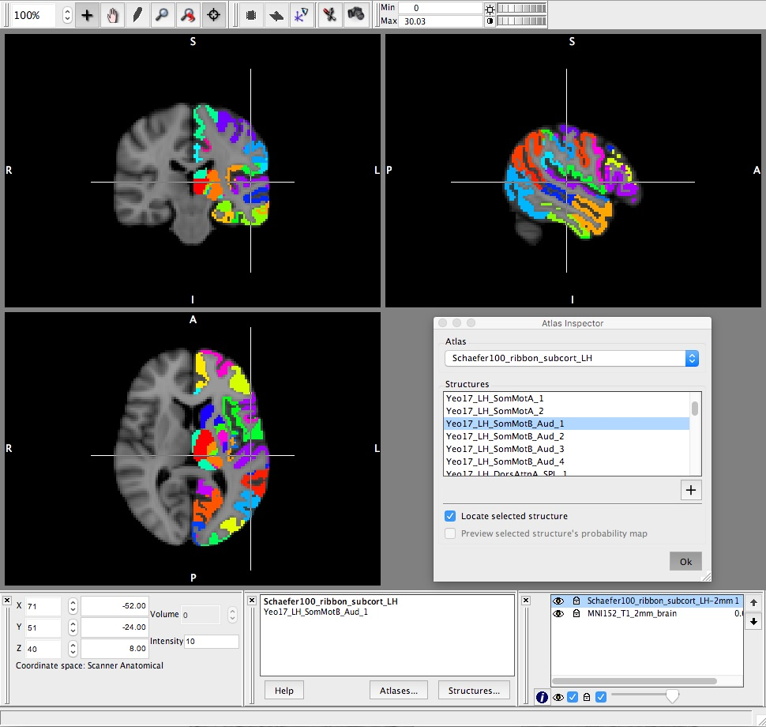

## Using the atlas in FSLview/FSLeyes

This folder contains the XML and the associated NIFTI images of the Schaefer100_ribbon_subcort_tract atlas for left and right hemispheres separately.

In order to use them in FSLview/FSLeyes, place a copy of these four files - not the ipython notebook - in the folder

```
$FSLDIR/data/atlases
```

After doing this, the atlas will be available in the Atlas toolbar of FSLview/eyes

A similar procedure can be used to import the atlas in [Mango](http://ric.uthscsa.edu/mango/atlas_spec.html)


